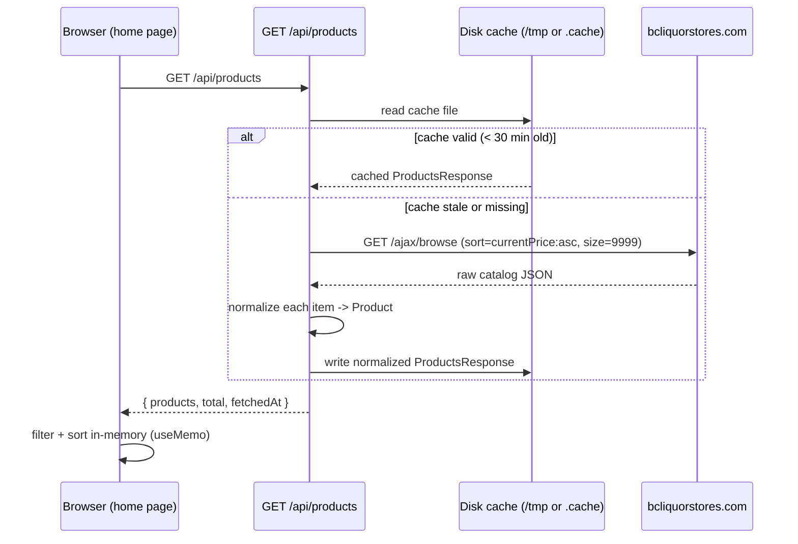
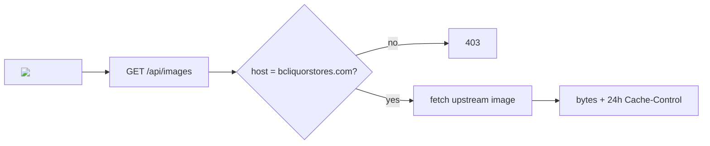

# Data Flow

## Product catalog flow

### Normalization (`src/app/api/products/route.ts`)

- `parseProduct()` maps the BCL AJAX payload into the typed `Product` shape.
- **Derived metrics are computed server-side:**
  - `pureAlcoholMl = volumeL * 1000 * (alcoholPercentage / 100)`
  - `pricePerMlPure = currentPrice / pureAlcoholMl` (rounded to 4 decimals)
  - `salePrice` is populated only when `isLimitedTimeOffer` is true.
- Image URLs are normalized from `.jpeg` to `.jpg`.
- Caching: 30-minute TTL on disk; the Netlify CDN layer adds
  `Cache-Control: public, max-age=900, stale-while-revalidate=3600` on `/api/*`.

### Error handling

- A cache miss + upstream failure returns an error response; the client shows an
  error state with a retry action.

## Image flow

Product images are **proxied** through `GET /api/images?url=<bc l image url>`
instead of being hotlinked directly:

1. The client renders ``.
2. The route validates the URL — only `www.bcliquorstores.com` hosts are
   allowed (otherwise `403`).
3. The route fetches the upstream image with a browser `User-Agent` and streams
   the bytes back with `Cache-Control: public, max-age=86400` (24 h).

This keeps the browser from hitting BCL directly, avoids mixed-content/CORS
issues, and centralizes cache policy for images.
