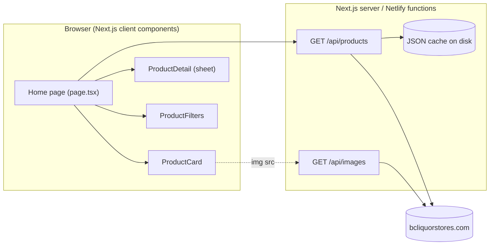

# Architecture Overview

## Purpose

CheapBooze is a read-only browsing experience for BC Liquor (BCL) products. It
lets shoppers find the best value-for-money spirits by comparing price per ml of
pure alcohol, filtering, and sorting the catalog.

## Stack

- **Framework:** Next.js 16 (App Router) with React 19
- **Language:** TypeScript (strict)
- **Styling:** Tailwind CSS v4 + shadcn/ui components (built on Base UI)
- **Deployment:** Netlify (static + serverless functions via `netlify.toml`)
- **Data source:** `www.bcliquorstores.com` public AJAX browse endpoint

## High-level structure

## Key components

| Layer | Module | Responsibility |
| ----- | ------ | -------------- |
| UI | `src/app/page.tsx` | Client component; fetches catalog, owns filter/sort/detail state |
| UI | `src/components/product-card.tsx` | Renders a single product tile |
| UI | `src/components/product-detail.tsx` | Side sheet with full product details |
| UI | `src/components/product-filters.tsx` | Filter + sort controls |
| API | `src/app/api/products/route.ts` | Fetches + normalizes + caches the BCL catalog |
| API | `src/app/api/images/route.ts` | Proxies product images from BCL |
| Shared | `src/lib/types.ts` | `Product` / `ProductsResponse` domain types |
| Shared | `src/lib/format.ts` | Price/volume formatting helpers |

## Runtime characteristics

- The app is effectively **server-rendered shell + client-side data fetch**:
  the home page hydrates then fetches `/api/products` on the client.
- All product filtering and sorting happens **in the browser** (single fetch of
  the full catalog, up to ~10k items).
- Serverless functions cache responses on disk (`/tmp` on Netlify/other
  serverless; `.cache/` locally) to avoid hammering the upstream BCL endpoint.
